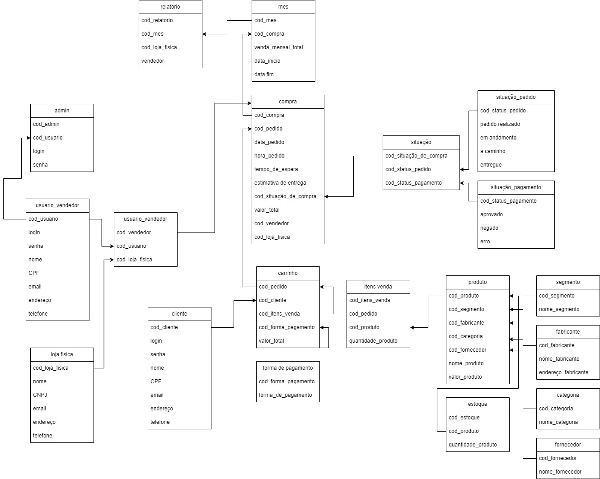

# Projetos de banco de dados

Neste projeto enfrentei alguns desafios e creio que o mais dificil deles foi utilizar o github, mas em relação ao trabalho tive algumas dificuldades sobre como fazer um carrinho de compras com o menor numero possivel de erros, fiz os status de pagamento e pedido, preferi adicionar algumas tabelas a mais para tentar deixar mais organizado o projeto.

##

##

Acima esta um JPG do projeto que fiz.

##

Mas caso queira tenho o projeto salvo em draw.io na pasta de bd.

