# Projetos de banco de dados

O princípio deste projeto é desenvolver um banco de dados conceitual para o aplicativo Zé delivery, desde criar tabelas da compra, carrinho, a empresa que vende o produto até uma tabela especifica para os fornecedores, diferenciando os produtos por segmentos e a categoria de cada um.
Colocando usuários administradores que alguns vendedores vão ter acesso, cada código do cliente pessoal, status de pagamento e statos do pedido.

##

##

Acima esta um JPG do projeto que fiz, Mas caso queira tenho o projeto salvo em draw.io na pasta de bd.
##

# Projeto lógico do Zé delivery

Nesta parte do projeto fiz a parte logica do Zé delivery como esta abaixo. 

##

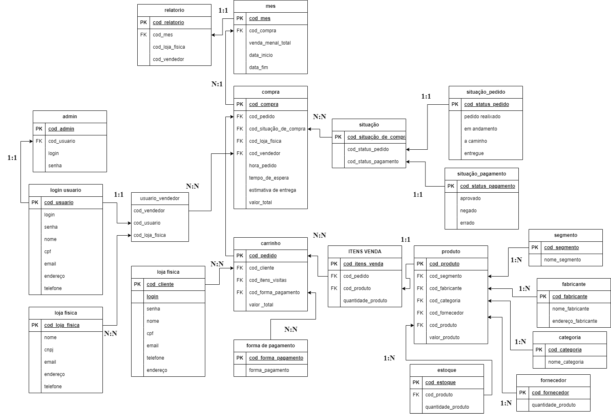

##

# Projeto Final 

O projeto sofreu algumas modificações de tabelas entre outras coisas.

# Tabela do inner join

### Nesta parte criei um inner join que mostra todos os pedidos feitos, com inumeros informação como vão ver a seguir.
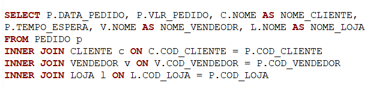
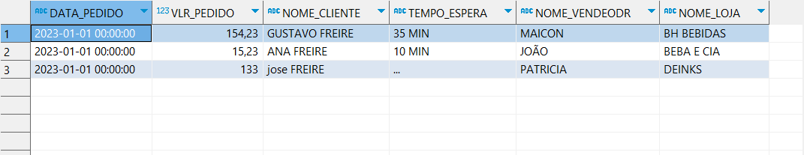
##

### Nesta parte mostra a soma de todos os pedidos, a data e o nome do cliente.
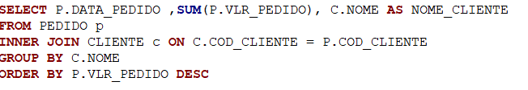
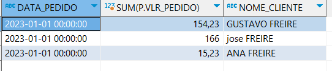

### Nesta parte mostra a soma toal de todos os pedidos pela data.
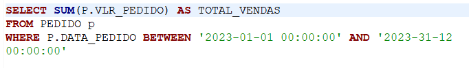
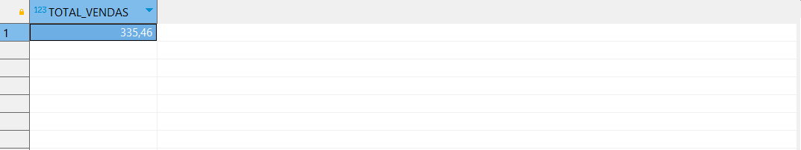
##

### Nesta parte mostra qual foi o vendedor que mais vendeu e o valor total da venda.
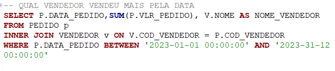
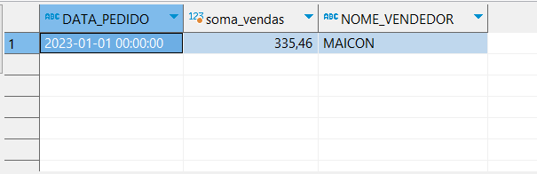
##

### Nesta parte mostra as vendas totais de cada vendedor.
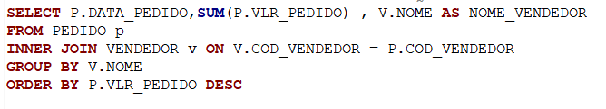
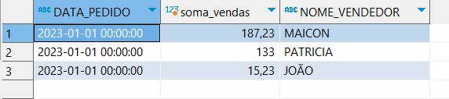
##

### Nesta todos os status do pedido.
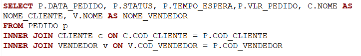
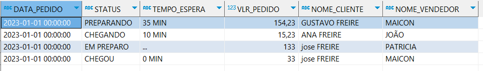
##

### Nesta pego todos os vendedores cadastrados e pedidos feitos.
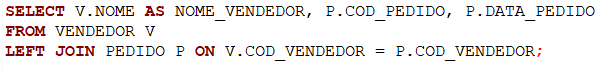
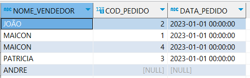
##

### Nesta pego todos os clientes cadastrados e pedidos feitos.
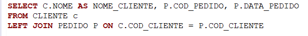
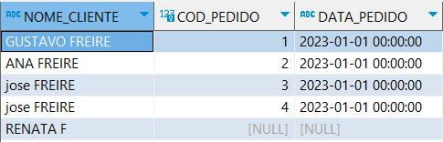
##

# Diagrama final
### O diagrama final fica desta forma com o banco completo
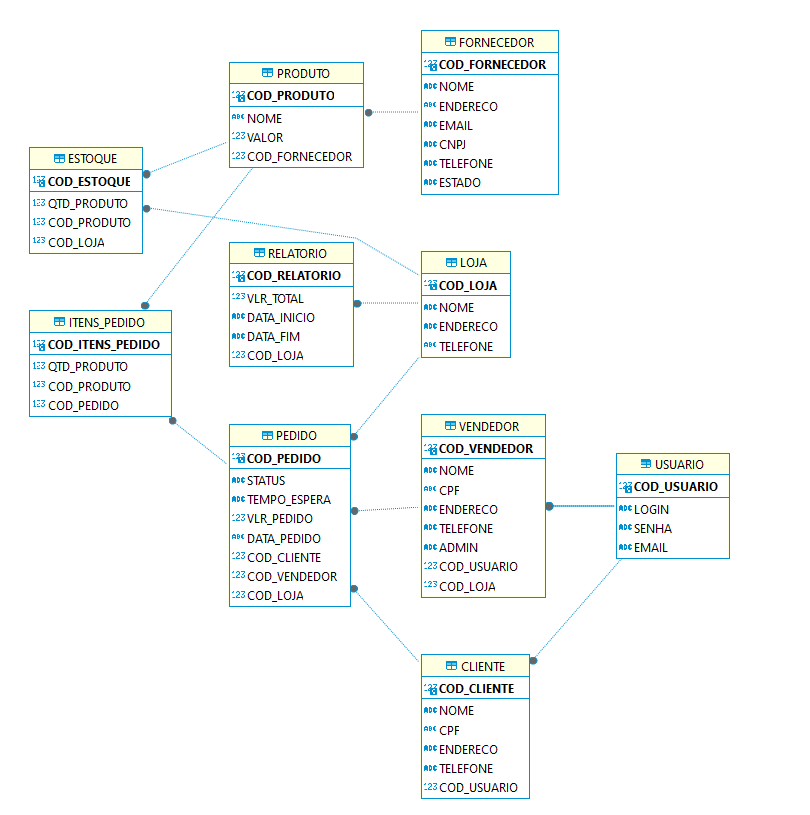
